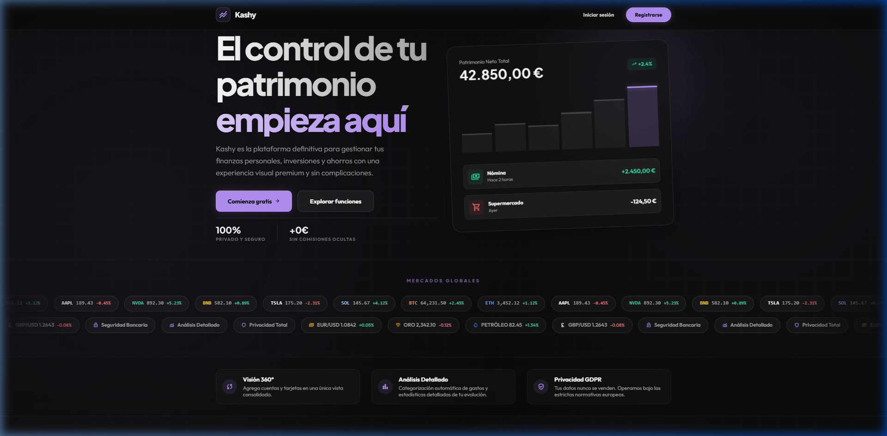
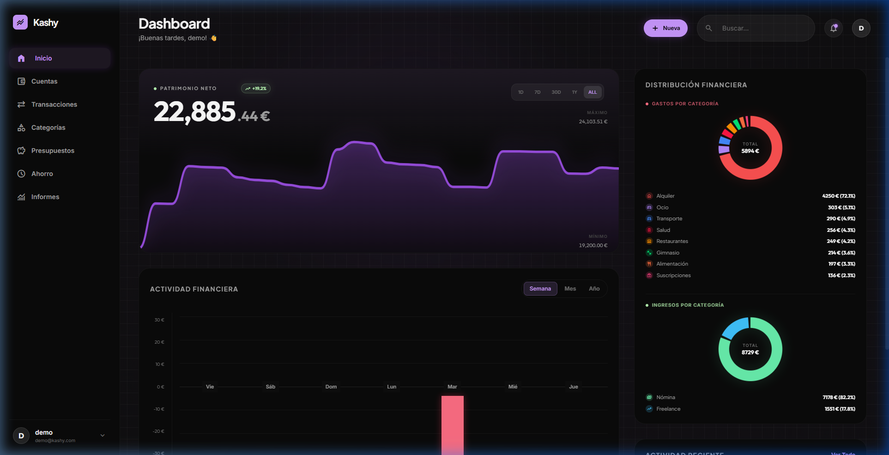
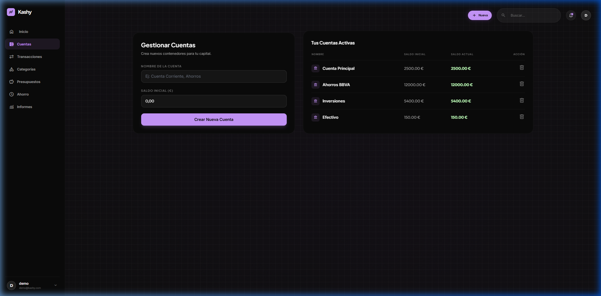
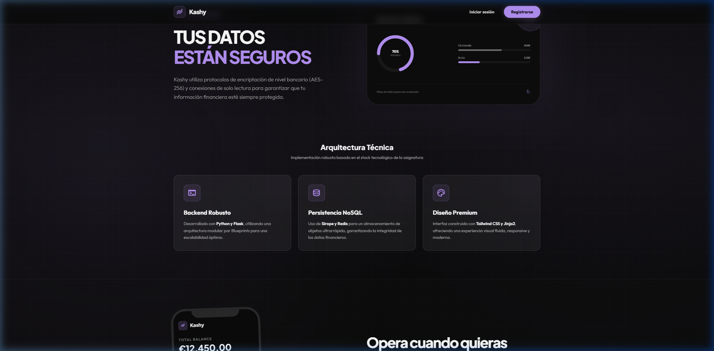

# 💰 Kashy Finance: Elite Wealth Management

[](https://kashy-finance.onrender.com)
[](https://github.com/maurozelenka/Kashy-Finance)

### 🚀 Visual Overview

<p align="center">
  
</p>

---

### 📊 Professional Dashboard

<p align="center">
  
  
</p>

---

### 🛠️ Technical Architecture

<p align="center">
  
</p>

---

## 💎 Project Essence

The architecture is built with a focus on data privacy, strict adherence to European General Data Protection Regulation (GDPR) standards, and compliance with the PSD2 directive.

## Core Features
- **Unified Dashboard:** Aggregation of multiple financial entities into a single, cohesive interface.
- **Categorization Engine:** Automated transaction classification to provide detailed insights into spending habits and financial evolution.
- **Bank-Grade Security:** Implementation of AES-256 encryption standards. The system operates strictly via read-only API connections, ensuring no transactional execution capabilities are exposed.
- **Responsive Architecture:** Progressive Web App (PWA) readiness, providing a native-like experience across desktop and mobile devices.

## Technical Stack
- **Backend:** Python 3, Flask
- **Authentication:** Flask-Login
- **Database / Persistence:** Sirope, Redis (with Fakeredis fallback for volatile development environments)
- **Frontend:** HTML5, Vanilla CSS, Tailwind CSS
- **Deployment:** Gunicorn (WSGI HTTP Server)

## Local Environment Setup

### Prerequisites
- Python 3.10 or higher
- Git

### Installation
1. Clone the repository:
   ```bash
   git clone <repository_url>
   cd Kashy-Finance
   ```

2. Create and activate a virtual environment:
   ```bash
   python -m venv venv
   source venv/bin/activate  # On Windows use: venv\Scripts\activate
   ```

3. Install the required dependencies:
   ```bash
   pip install -r requirements.txt
   ```

4. Start the application:
   ```bash
   python src/app.py
   ```
   *Alternatively, for a production-like environment using Gunicorn:*
   ```bash
   gunicorn --chdir src "app:create_app()"
   ```

5. Access the application at `http://127.0.0.1:5000/`.

## License
Copyright (c) 2026 Kashy Finance. All rights reserved.
 
